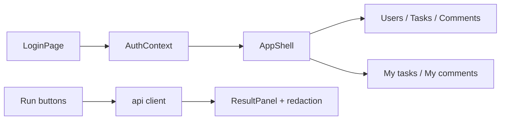

# Admin console & project changes — overview

This document explains what was added when the full frontend admin console and env-based seeding were implemented, compared to the earlier app (login + read-only task list only).

---

## Big picture

| Before | After |
|--------|--------|
| 2 pages, 2 API calls (`login`, list tasks) | Full admin console for **all** REST endpoints |
| Credentials in Java + `LoginPage` | Credentials in **gitignored** `.env` only |
| Single dashboard | Role-based routes (ADMIN vs USER) |

---

## Backend (Java)

### New: `src/main/java/com/usermanagement/config/DevSeedRunner.java`

- Runs **once at startup** when the Spring profile `dev-seed` is active (Docker Compose enables this via `SPRING_PROFILES_ACTIVE=docker,dev-seed,filelog`).
- Reads `SEED_ADMIN1_*`, `SEED_ADMIN2_*`, `SEED_USER1_*`, `SEED_USER2_*` from the environment (your root `.env`).
- Creates 2 admins, 2 regular users, 4 tasks, and task assignments.
- **No emails or passwords in source code** — only env variable names.

If any required `SEED_*` variable is missing, seeding is skipped and an error is logged.

### Changed: `UserManagementApplication.java`

- Now only contains `main()` — seed logic moved to `DevSeedRunner`.

### New at repo root: `.env.example`

- Documents which variables to copy into gitignored `.env` (`JWT_SECRET`, all `SEED_*` keys).
- Uses placeholders only; never commit real secrets.

---

## Frontend — API layer

| File | Purpose |
|------|---------|
| `frontend/src/api/types.ts` | TypeScript types for users, tasks, comments, and request/response DTOs. |
| `frontend/src/api/client.ts` | HTTP helpers: `apiGet`, `apiPost`, **`apiPut`**, **`apiDelete`**; JWT in `Authorization` header. |
| `frontend/src/api/paths.ts` | Builds assign URL `/api/task/admin/assignUser{taskId}/{userId}` (no slash after `assignUser`, matching the backend). |

---

## Frontend — Auth & routing

| File | Purpose |
|------|---------|
| `frontend/src/auth/AuthContext.tsx` | Global session: calls `/api/auth/me` when a token exists; exposes `me`, `loading`, `logout`, `refresh`. |
| `frontend/src/components/ProtectedRoute.tsx` | Redirects to `/login` without a token; **`AdminRoute`** / **`UserRoute`** block wrong roles. |
| `frontend/src/App.tsx` | Route map with `AuthProvider` and nested routes under `AppShell`. |

### Removed

- `frontend/src/pages/DashboardPage.tsx` — replaced by overview + section pages.

### Routes

| Route | Who | Purpose |
|-------|-----|---------|
| `/login` | Public | Sign in |
| `/` | Authenticated | Overview + session info |
| `/users` | ADMIN | User management |
| `/tasks` | ADMIN | Task management |
| `/comments` | ADMIN | Comment management |
| `/my-tasks` | USER | Assigned tasks + mark complete |
| `/my-comments` | USER | Comments on tasks |

---

## Frontend — Reusable UI

Shared building blocks used on action pages:

| File | Purpose |
|------|---------|
| `frontend/src/components/AppShell.tsx` | Sidebar navigation + header (email, role, Swagger link, logout). |
| `frontend/src/components/PageSection.tsx` | Card with title and description for each API group. |
| `frontend/src/components/DataTable.tsx` | Generic striped table for list responses. |
| `frontend/src/components/Field.tsx` | Label + shared input/button CSS classes. |
| `frontend/src/components/ResultPanel.tsx` | Shows API result after **Run** (uses redaction helper). |
| `frontend/src/hooks/useAction.ts` | `loading` / `error` / `result` state for each action. |

---

## Frontend — Pages

| Page | Route | API coverage (summary) |
|------|-------|----------------------|
| `LoginPage.tsx` | `/login` | `POST /api/auth/login` |
| `OverviewPage.tsx` | `/` | Session + quick links |
| `UsersPage.tsx` | `/users` | List, pagination, register, update, delete users |
| `TasksPage.tsx` | `/tasks` | List, pagination, CRUD, assign, unassign tasks |
| `CommentsPage.tsx` | `/comments` | List, create, update comments (admin) |
| `MyTasksPage.tsx` | `/my-tasks` | User task list + mark complete |
| `MyCommentsPage.tsx` | `/my-comments` | Comment on task + two comment list endpoints |

**Pattern on each page:** form fields → **Run** → **`ResultPanel`** (and tables where lists apply).

---

## Frontend — Privacy (private admin email)

| File | Purpose |
|------|---------|
| `frontend/src/utils/redactSensitiveInResults.ts` | Used only in **ResultPanel**: replaces `VITE_PRIVATE_ADMIN_EMAIL` with `[private admin]`; strips `password` fields and JWT `token`. |
| `frontend/src/vite-env.d.ts` | TypeScript types for `VITE_*` env vars. |

**Scope:** Redaction applies to **action result panels only**, not headers or data tables. Set `VITE_PRIVATE_ADMIN_EMAIL` in gitignored `frontend/.env.local` to match `SEED_ADMIN1_EMAIL` in root `.env`.

---

## Config & documentation

| File | Purpose |
|------|---------|
| `.env.example` | Template for root `.env` (JWT + all `SEED_*`). |
| `frontend/.env.example` | Template for `frontend/.env.local` (redaction + optional demo login pre-fill). |
| `readMe.md` | Updated setup for seed and frontend env. |
| `frontend/README.md` | Dev commands and route list. |
| `.gitignore` | `!.env.example` so example env files are committed. |

**Local only (not in git):**

- Root `.env` — real `JWT_SECRET` and `SEED_*` values.
- `frontend/.env.local` — `VITE_PRIVATE_ADMIN_EMAIL`, optional `VITE_DEMO_EMAIL` / `VITE_DEMO_PASSWORD`.

---

## What stayed the same

- **Stack:** Vite, React, React Router, Tailwind (no new UI library).
- **Backend API:** Same Spring controllers; the frontend now calls all endpoints.
- **JWT storage:** `sessionStorage`, sent as `Bearer` on API requests.

---

## Request flow (example)

1. Open **Users** → fill “Register user” → click **Run**.
2. `useAction.run()` calls `apiPost("/api/auth/admin/registerUser", body)`.
3. Response is shown in **`ResultPanel`** via `formatResultForDisplay()` (redaction applied).
4. **Refresh list** loads users again with `apiGet`.

---

## Local setup checklist

1. Copy `.env.example` → `.env` and fill `JWT_SECRET` + all `SEED_ADMIN1_*`, `SEED_ADMIN2_*`, `SEED_USER1_*`, `SEED_USER2_*`.
2. Copy `frontend/.env.example` → `frontend/.env.local` and set `VITE_PRIVATE_ADMIN_EMAIL` = same as `SEED_ADMIN1_EMAIL`.
3. Start backend with `dev-seed` (e.g. `docker compose up` or `SPRING_PROFILES_ACTIVE=local,dev-seed mvn spring-boot:run`).
4. Start frontend: `cd frontend && npm install && npm run dev`.

---

## Note on restarts

`registerUser` fails if the email already exists. On a **second** startup against the same database, seeding may error unless seed logic is made idempotent (skip existing users/tasks) or the DB is reset. This is expected with the current `DevSeedRunner` behavior.
