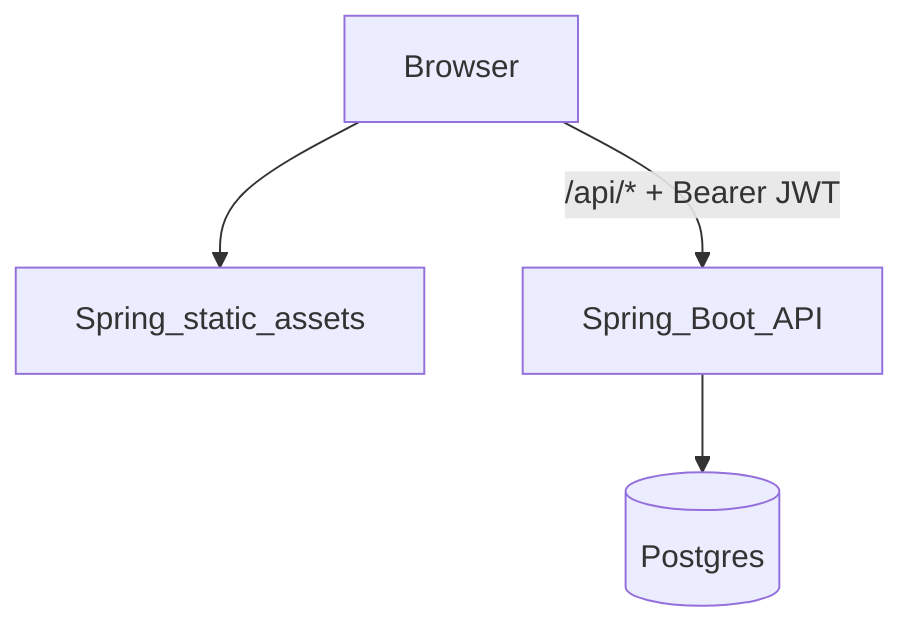
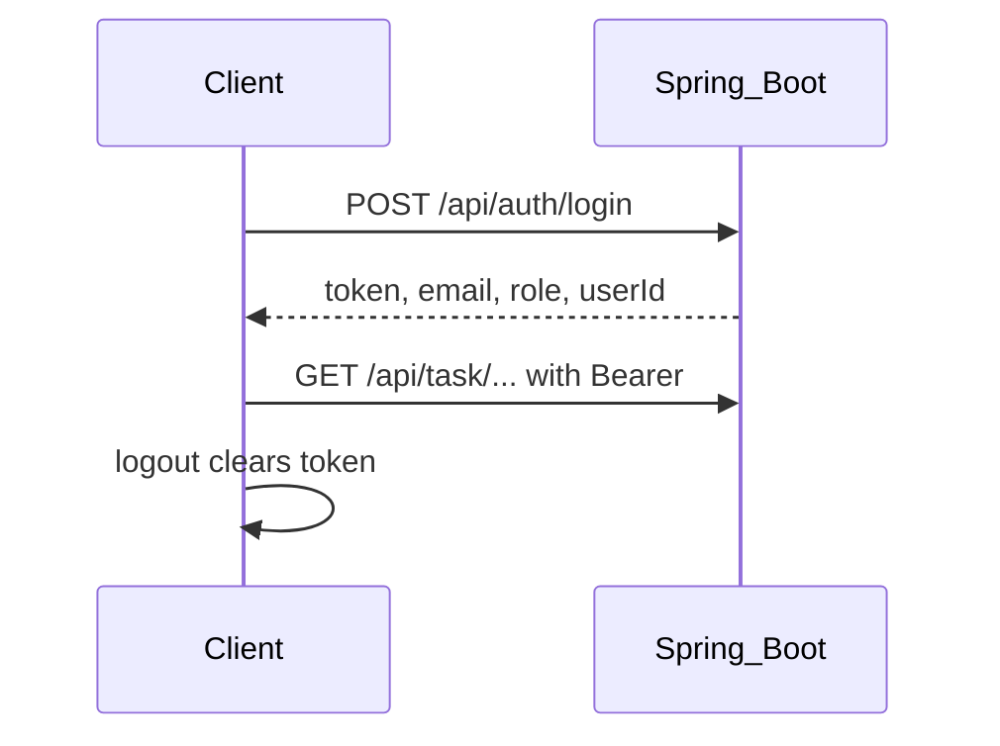

# User Management — Team Task App (Portfolio Demo)

**Live demo:** [http://user-managment-app-oren.duckdns.org:8080/login](http://user-managment-app-oren.duckdns.org:8080/login) (hosted on a GCE VM)

**Docker image:** [`orenv3/user-managment-app:1.1`](https://hub.docker.com/r/orenv3/user-managment-app)

**Local dev:** `http://localhost:8080/`

[Try the demo](#try-the-demo) · [For developers](#for-developers)

---

## For everyone

A web app where **managers** assign tasks to team members, track progress, and discuss work in comments. **Team members** see only their own assignments, mark tasks complete, and leave comments.

Built as a portfolio project to demonstrate secure, production-style full-stack development — not just a tutorial API.

### Try the demo

Open the [live app](http://user-managment-app-oren.duckdns.org:8080/login) or run it locally (see [Run with Docker Compose](#run-with-docker-compose-recommended)).

| Role | What you can do |
|------|-----------------|
| **Manager (Admin)** | Manage users, create and assign tasks, view all comments, see usage analytics |
| **Team member (User)** | View assigned tasks, mark them complete, add comments |

**Demo logins** (must match your deployed seed values — see [Seed data](#seed-data-optional)):

| Role | Email | Password |
|------|-------|----------|
| Manager | `admin@example.com` | *(your `SEED_ADMIN2_PASSWORD`)* |
| Team member | `user@example.com` | *(your `SEED_USER1_PASSWORD`)* |

On the login page, click **Use manager account** or **Use team member account**, then **Login**.

**Quick walkthrough (~2 minutes):**

1. Log in as **Admin** → open **Tasks** → create a task and assign it to the demo user
2. Log out → log in as **User** → open **My tasks** → mark the task complete and add a comment
3. Log back in as **Admin** → open **Comments** (or **Tasks**) → confirm the update

### Demo video

A walkthrough video can appear on the login page when configured:

1. Host your recording on YouTube (recommended) or place an MP4 at `frontend/public/demo.mp4`
2. Set `VITE_DEMO_VIDEO_URL` in the **repo-root** [`.env`](.env) (same file as `JWT_SECRET` and `SEED_*`), e.g. `https://youtu.be/4f4ND3ctlD8` or `/demo.mp4`
3. Rebuild (`docker compose up --build` or `npm run build` in `frontend/`)

If no video URL is configured, the login page works normally without a video section.

---

## For developers

User/task/comment management API with role-based access (**ADMIN** vs **USER**) and a JWT-based authentication flow. Designed to be docker-friendly and portfolio-ready.

### Tech stack

- **Java 17**, **Spring Boot 3.2**
- **Spring Security** (stateless JWT)
- **Spring Data JPA** + **PostgreSQL** (runtime)
- **H2** (tests)
- **MapStruct** (DTO ↔ entity mapping)
- **Springdoc OpenAPI / Swagger UI**
- **Docker** / **docker compose**
- **JUnit 5 + Mockito** + `@SpringBootTest` integration tests

### Architecture (high level)



Auth flow:



### Main features

- **Authentication**: `POST /api/auth/login` returns a JWT (`AuthResponse`).
- **Authorization**:
  - URLs containing `/admin/` require `ADMIN`
  - URLs containing `/user/` require `USER`
- **Tasks**
  - Admin can create/update/delete tasks and assign/unassign tasks
  - User can list only assigned tasks and mark tasks as completed
  - Archived tasks are not visible to users
- **Comments**
  - User can comment only on tasks assigned to them
  - User sees all comments on their tasks (including comments created by others/admin)
- **Validation + structured errors**
  - Bean validation (`@Valid`) returns **400** with JSON error body (`ApiErrorResponse`)
  - Domain/service rules return **400/409** with JSON error body

### API docs (Swagger)

**Local:**

- Swagger UI: `http://localhost:8080/swagger-ui/index.html`
- OpenAPI JSON: `http://localhost:8080/v3/api-docs`

**Live (GCE):**

- Swagger UI: [http://user-managment-app-oren.duckdns.org:8080/swagger-ui/index.html](http://user-managment-app-oren.duckdns.org:8080/swagger-ui/index.html)
- OpenAPI JSON: `http://user-managment-app-oren.duckdns.org:8080/v3/api-docs`

Logging into the web app does **not** pass a token to Swagger — the UI stores the JWT in `sessionStorage`, and the API is stateless.

**Test protected endpoints in Swagger:**

1. Open Swagger UI (local or live).
2. Under **AuthenticationController**, run **POST** `/api/auth/login` with demo credentials (see [Seed data](#seed-data-optional) or the [demo logins](#try-the-demo) table).
3. Copy the `token` value from the response.
4. Click **Authorize** (lock icon) and paste the JWT into `bearerAuth` (token only — no `Bearer ` prefix).
5. Call protected endpoints; **GET** `/api/auth/me` is a quick sanity check.
6. Role matters: `/admin/` endpoints need an **ADMIN** token; `/user/` endpoints need a **USER** token.

Example login body:

```json
{
  "email": "admin@example.com",
  "password": "<your SEED_ADMIN2_PASSWORD>"
}
```

### Run locally (without Docker)

1. Start PostgreSQL locally and create DB `user_management_db`.
2. Set JWT secret (Base64).

You have 2 options:

**Option A — export `JWT_SECRET` in your shell (local runs):**

```bash
export JWT_SECRET="your-base64-secret"
```

**Option B — set secrets in a root `.env` file (for Docker Compose and dev-seed):**

- Copy [`.env.example`](.env.example) to `./.env` at the project root (same folder as `docker-compose.yml`).
- Fill in `JWT_SECRET` and, if you use `dev-seed`, **all** `SEED_ADMIN1_*`, `SEED_ADMIN2_*`, `SEED_USER1_*`, and `SEED_USER2_*` values (see [Seed data](#seed-data-optional)).

To generate a strong Base64 secret:

```bash
openssl rand -base64 32
```

3. Run the app (defaults to `local` profile):

```bash
mvn spring-boot:run
```

### Run with Docker Compose (recommended)

Build from source:

```bash
docker compose up --build
```

Or pull the published image and run with Compose (replace `build: .` with `image: orenv3/user-managment-app:1.1` under the `app` service in `docker-compose.yml`):

```bash
docker pull orenv3/user-managment-app:1.1
docker compose up
```

- App: `http://localhost:8080/`
- Swagger: `http://localhost:8080/swagger-ui/index.html`
- Postgres exposed on host `5433` (container `5432`)

### Tests

```bash
mvn test
```

Tests run under the `test` profile (H2 in-memory), and include:

- **Unit tests** (Mockito): `TaskServiceTest`, `UserServiceTest`, `CommentServiceTest`, `AuthenticationServiceTest`, `JwtServiceTest`
- **Integration tests** (`@SpringBootTest` + `MockMvc`): `ApplicationApiIntegrationTest`
- **Repository tests** (`@DataJpaTest`): `UserRepoTest`, `TaskRepoTest`, `CommentRepoTest`

### Seed data (optional)

The startup seed runs only when the `dev-seed` profile is active. It reads credentials from environment variables (via `.env` for Docker, or your shell / IDE run config locally). **No seed emails or passwords are stored in source code.**

Required in `.env` when using `dev-seed`:

- `SEED_ADMIN1_EMAIL`, `SEED_ADMIN1_PASSWORD`, `SEED_ADMIN1_NAME` — first admin (e.g. private dev account)
- `SEED_ADMIN2_EMAIL`, `SEED_ADMIN2_PASSWORD`, `SEED_ADMIN2_NAME` — second admin
- `SEED_USER1_*`, `SEED_USER2_*` — demo regular users

If any required variable is missing or blank, seeding is skipped and an error is logged.

Example:

```bash
# Ensure .env is populated (copy from .env.example)
SPRING_PROFILES_ACTIVE=local,dev-seed mvn spring-boot:run
```

Docker Compose already loads `.env` and activates `dev-seed` via `SPRING_PROFILES_ACTIVE`.

#### Frontend env (same file as backend)

All `VITE_*` variables belong in the **repo-root** [`.env`](.env) (see [`.env.example`](.env.example)). Vite reads them via `envDir` in `frontend/vite.config.ts`. Docker copies root `.env` during image build.

- `VITE_PRIVATE_ADMIN_EMAIL` — same value as `SEED_ADMIN1_EMAIL`; redacted in action result panels
- `VITE_SEED_*` — pre-fill demo login/register forms (match `SEED_USER1_*` / `SEED_ADMIN2_*`)
- `VITE_DEMO_VIDEO_URL` — optional; YouTube URL (e.g. `https://youtu.be/4f4ND3ctlD8`) or local path `/demo.mp4`
- `VITE_PROJECT_REPO_URL` — optional; GitHub repo URL for “About this project” link on login page

Rebuild the image or restart the Vite dev server after changing any `VITE_*` value.
