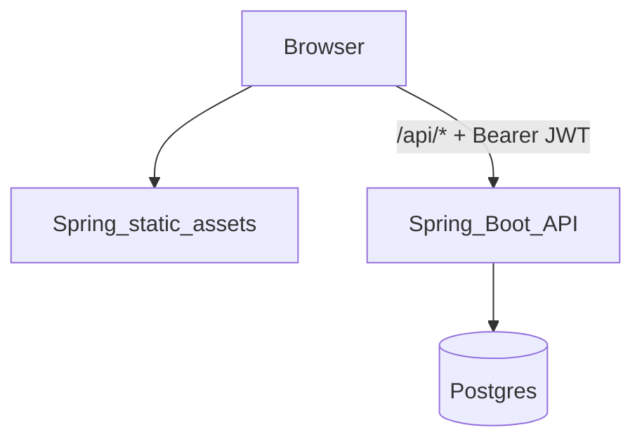
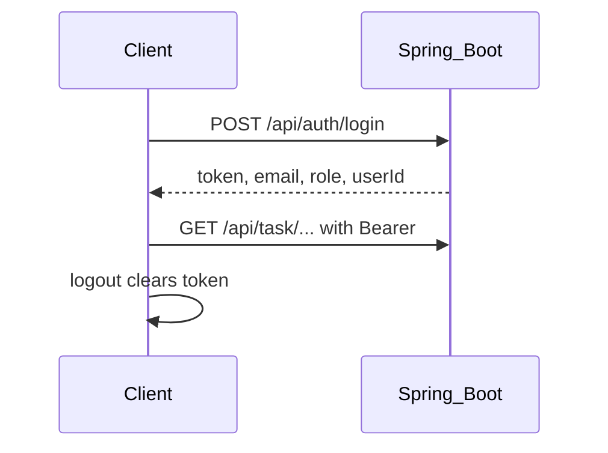

# User Management (Spring Boot + PostgreSQL + JWT)

User/task/comment management API with role-based access (**ADMIN** vs **USER**) and a JWT-based authentication flow. Designed to be docker-friendly and portfolio-ready.

## Tech stack

- **Java 17**, **Spring Boot 3.2**
- **Spring Security** (stateless JWT)
- **Spring Data JPA** + **PostgreSQL** (runtime)
- **H2** (tests)
- **MapStruct** (DTO ↔ entity mapping)
- **Springdoc OpenAPI / Swagger UI**
- **Docker** / **docker compose**
- **JUnit 5 + Mockito** + `@SpringBootTest` integration tests

## Architecture (high level)



Auth flow:



## Main features

- **Authentication**: `POST /api/auth/login` returns a JWT (`AuthResponse`).
- **Authorization**:
  - URLs containing `/admin/` require `ADMIN`
  - URLs containing `/user/` require `USER`
- **Tasks**
  - Admin can create/update/delete tasks and assign/unassign tasks
  - User can list only assigned tasks and mark tasks as completed
  - Archived tasks are not visible to users
- **Comments**
  - User can comment only on tasks assigned to them
  - User sees all comments on their tasks (including comments created by others/admin)
- **Validation + structured errors**
  - Bean validation (`@Valid`) returns **400** with JSON error body (`ApiErrorResponse`)
  - Domain/service rules return **400/409** with JSON error body

## API docs (Swagger)

- Swagger UI: `http://localhost:8080/swagger-ui/index.html`
- OpenAPI JSON: `http://localhost:8080/v3/api-docs`

## Run locally (without Docker)

1. Start PostgreSQL locally and create DB `user_management_db`.
2. Set JWT secret (Base64).

You have 2 options:

**Option A — export `JWT_SECRET` in your shell (local runs):**

```bash
export JWT_SECRET="your-base64-secret"
```

**Option B — set `JWT_SECRET` in a root `.env` file (for Docker Compose):**

- Create `./.env` at the project root (same folder as `docker-compose.yml`).
- Add:

```env
JWT_SECRET=your-base64-secret
```

To generate a strong Base64 secret:

```bash
openssl rand -base64 32
```

3. Run the app (defaults to `local` profile):

```bash
mvn spring-boot:run
```

## Run with Docker Compose (recommended)

```bash
docker compose up --build
```

- App: `http://localhost:8080/`
- Swagger: `http://localhost:8080/swagger-ui/index.html`
- Postgres exposed on host `5433` (container `5432`)

## Tests

```bash
mvn test
```

Tests run under the `test` profile (H2 in-memory), and include:

- **Unit tests** (Mockito): `TaskServiceTest`, `UserServiceTest`, `CommentServiceTest`, `AuthenticationServiceTest`, `JwtServiceTest`
- **Integration tests** (`@SpringBootTest` + `MockMvc`): `ApplicationApiIntegrationTest`
- **Repository tests** (`@DataJpaTest`): `UserRepoTest`, `TaskRepoTest`, `CommentRepoTest`

## Seed data (optional)

The startup seed (`CommandLineRunner`) is disabled by default and only runs when the `dev-seed` profile is active.

Example:

```bash
SPRING_PROFILES_ACTIVE=local,dev-seed mvn spring-boot:run
```